# 校园失物招领系统

一个基于 HTML、CSS 和原生 JavaScript 实现的校园失物招领网页，为校园内的失物信息发布、招领信息浏览和物品状态管理提供简单直观的操作入口。

## 项目信息

- 项目成员：102401434 包学丰、102401436 冯玄
- 开发方式：Git 分支协作、Fork、Pull Request
- 项目仓库：[102401434-102401436](https://github.com/tw1l1ghtcc/102401434-102401436)
- 在线演示：[GitHub Pages](https://tw1l1ghtcc.github.io/102401434-102401436/)
- 交互原型：[Figma 原型](https://www.figma.com/design/tTIMlQHjhwiKaSm3qshgPh/Untitled?node-id=0-1)
- 第一次作业仓库：[campus-lost-found](https://github.com/tw1l1ghtcc/campus-lost-found)

## 项目说明

本项目是 2026 年秋季软件工程第二次结对作业。

项目在第一次作业需求分析和交互原型的基础上，使用 HTML5、CSS3 和原生 JavaScript 完成校园失物招领系统。

系统采用纯静态 Web 方案，不依赖后台服务器。用户发布的信息及状态变化通过浏览器 `localStorage` 保存在本地，刷新或重新打开网页后数据仍然存在。

## 主要功能

- 浏览寻物和招领信息
- 查看物品详细信息及联系方式
- 根据关键词搜索物品
- 根据寻物、招领类型进行筛选
- 根据物品分类进行筛选
- 发布寻物信息
- 发布招领信息
- 查看本人发布的信息
- 将寻物信息修改为“已找回”
- 将招领信息修改为“已归还”
- 使用浏览器本地存储保存数据
- 兼容旧版本地存储数据
- 表单输入校验及错误提示
- 页面切换和弹窗交互动画
- 移动端页面布局适配

## 项目效果展示

### 操作演示

<p align="center">
  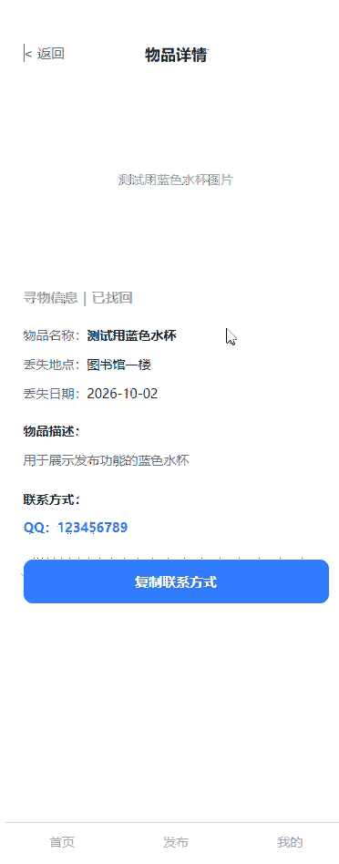
</p>

### 首页与搜索

<table>
  <tr>
    <td align="center">
      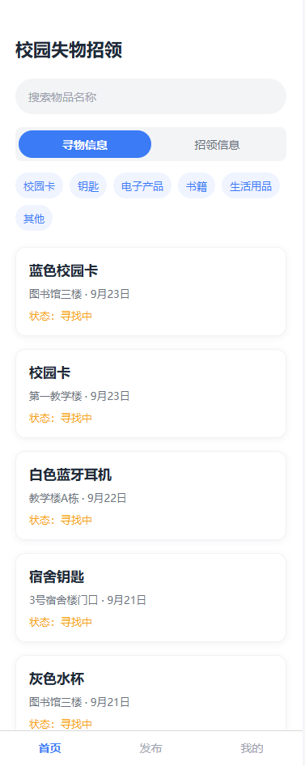<br>
      <strong>系统首页</strong>
    </td>
    <td align="center">
      <br>
      <strong>搜索与筛选结果</strong>
    </td>
  </tr>
</table>

### 详情查看与信息发布

<table>
  <tr>
    <td align="center">
      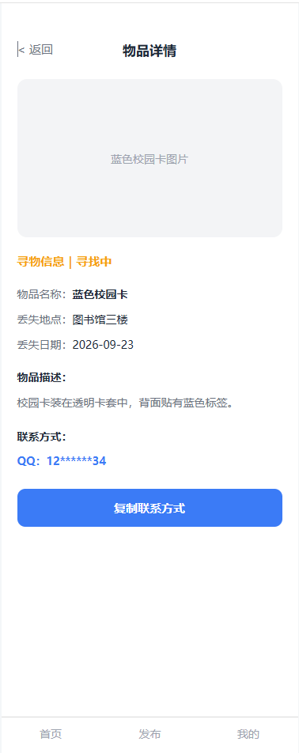<br>
      <strong>物品详情</strong>
    </td>
    <td align="center">
      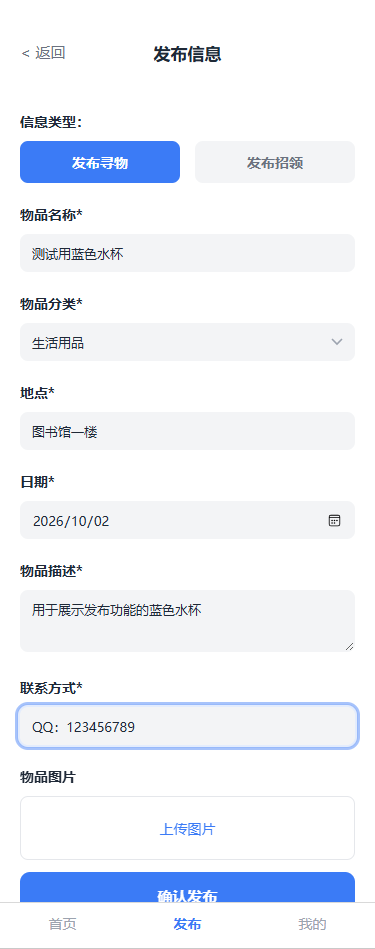<br>
      <strong>发布表单</strong>
    </td>
    <td align="center">
      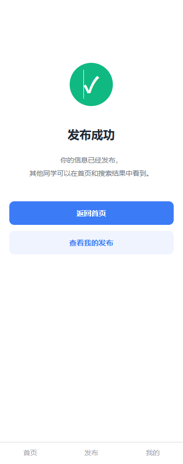<br>
      <strong>发布成功</strong>
    </td>
  </tr>
</table>

### 我的发布与状态修改

<table>
  <tr>
    <td align="center">
      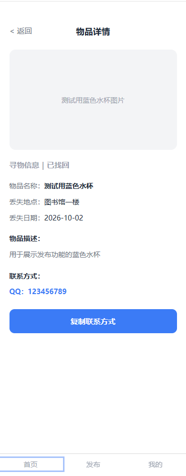<br>
      <strong>我的发布</strong>
    </td>
    <td align="center">
      <br>
      <strong>状态修改</strong>
    </td>
  </tr>
</table>

## 系统设计

### 系统功能流程图

<p align="center">
  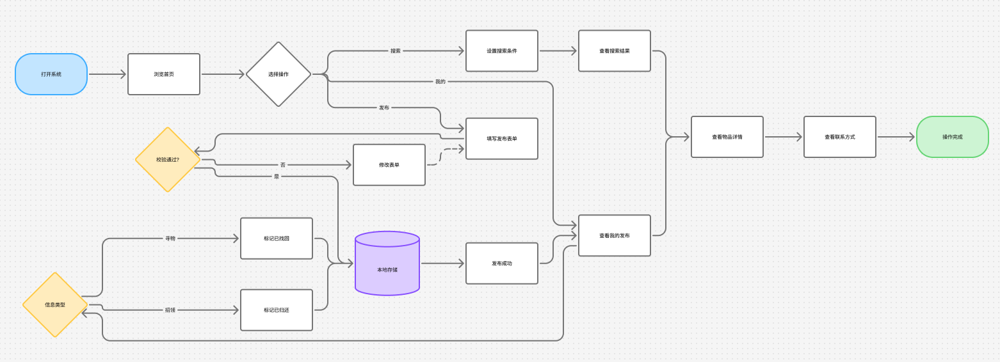
</p>

用户进入系统后可以浏览信息，并通过搜索、类型和分类筛选查找目标物品。用户也可以进入发布页面填写信息，提交成功后在“我的发布”中查看并修改物品状态。

### 系统数据流图

<p align="center">
  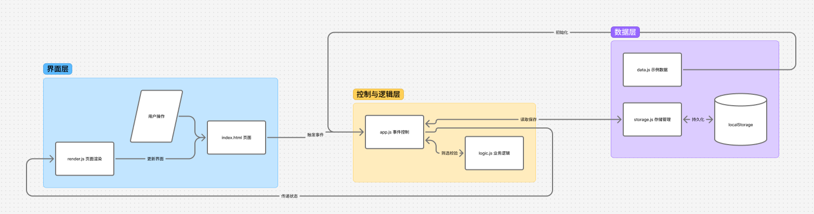
</p>

系统启动时从 `localStorage` 读取数据，并将数据传递给搜索、筛选和页面渲染模块。用户发布信息或修改状态后，系统重新保存数据并刷新页面展示。

## 技术方案

- HTML5
- CSS3
- 原生 JavaScript
- 浏览器 `localStorage`
- Node.js 基础测试脚本
- Jest 单元测试
- jsdom 浏览器环境模拟
- Git 与 GitHub 协作开发
- GitHub Pages 静态网站部署

## 模块设计

### `data.js`

保存项目示例数据和公共常量，为系统首次运行提供默认的寻物和招领信息。

### `storage.js`

负责读取、保存和兼容浏览器本地数据，将数据统一保存在 `localStorage` 中。

### `logic.js`

负责关键词搜索、类型筛选、分类筛选、表单校验和信息状态修改等业务逻辑。

### `render.js`

负责将数据渲染为信息卡片、搜索结果、详情内容和“我的发布”列表。

### `app.js`

负责页面初始化、页面导航、事件绑定、弹窗控制、信息发布和用户交互。

## 项目结构

```text
102401434-102401436/
├─ assets/
│  └─ screenshots/            # 功能截图、测试结果、流程图和演示动图
│     ├─ 01-home.png
│     ├─ 02-search-results.png
│     ├─ 03-item-detail.png
│     ├─ 04-publish-form.png
│     ├─ 05-publish-success.png
│     ├─ 06-my-items.png
│     ├─ 07-status-changed.png
│     ├─ 08-basic-tests.png
│     ├─ 09-jest-tests.png
│     ├─ 10-github-commits.png
│     ├─ 11-pull-requests.png
│     ├─ 12-repository-home.png
│     ├─ 13-ui-animation.gif
│     ├─ 14-system-flowchart.png
│     └─ 15-data-flow.png
├─ css/
│  └─ style.css                # 页面布局、视觉样式和交互动画
├─ docs/
│  ├─ psp.md                   # PSP预估与实际耗时
│  ├─ psp-复盘.md              # PSP复盘与总结
│  ├─ 上传时间表.md
│  └─ 设计核对清单.md
├─ js/
│  ├─ data.js                  # 示例数据和公共常量
│  ├─ storage.js               # 浏览器本地存储
│  ├─ logic.js                 # 搜索、筛选、校验和状态处理
│  ├─ render.js                # 页面内容渲染
│  └─ app.js                   # 页面导航和事件绑定
├─ tests/
│  ├─ cases.js                 # 基础测试用例
│  ├─ index.html               # 浏览器测试页面
│  └─ run-tests.js             # Node.js基础测试入口
├─ unit-tests/
│  ├─ tests/                   # Jest测试文件
│  ├─ api.js                   # 模拟提交接口
│  ├─ package.json             # 测试依赖及执行命令
│  └─ README.md                # 单元测试说明
├─ .gitignore
├─ index.html                  # 应用入口页面
└─ README.md                   # 项目说明
```

## 使用说明

### 在线运行

访问项目的 GitHub Pages 页面：

[https://tw1l1ghtcc.github.io/102401434-102401436/](https://tw1l1ghtcc.github.io/102401434-102401436/)

### 本地运行

项目不需要构建，也不需要为网页功能安装依赖。

在 Developer PowerShell 中执行：

```powershell
git clone https://github.com/tw1l1ghtcc/102401434-102401436.git
Set-Location "102401434-102401436"
Start-Process .\index.html
```

也可以下载项目后，在文件资源管理器中双击 `index.html`。

### 基本操作

1. 打开系统首页，浏览最新的寻物和招领信息。
2. 点击“寻物”或“招领”切换信息类型。
3. 使用物品分类选项筛选对应类别的信息。
4. 进入搜索页面，输入关键词并组合类型、分类条件进行搜索。
5. 点击信息卡片查看物品详情和联系方式。
6. 通过底部导航栏的“发布”入口发布寻物或招领信息。
7. 发布成功后进入“我的”页面查看本人发布的信息。
8. 在“我的发布”中将寻物信息标记为“已找回”，或将招领信息标记为“已归还”。

## 本地存储说明

系统使用以下键保存物品数据：

```text
campus-lost-found-items
```

发布的新信息和修改后的状态都会保存在当前浏览器中，刷新或重新打开页面后数据不会丢失。

如果需要恢复项目自带的示例数据，可以打开浏览器开发者工具，在控制台中执行：

```javascript
localStorage.removeItem("campus-lost-found-items");
location.reload();
```

本项目没有后台数据库，不同浏览器或不同设备之间不会自动同步数据。

## 单元测试

项目提供两套测试方式：

- Node.js 基础测试
- Jest 与 jsdom 单元测试

### 基础测试

在项目根目录执行：

```powershell
node .\tests\run-tests.js
```

当前测试结果：35 项测试全部通过。

<p align="center">
  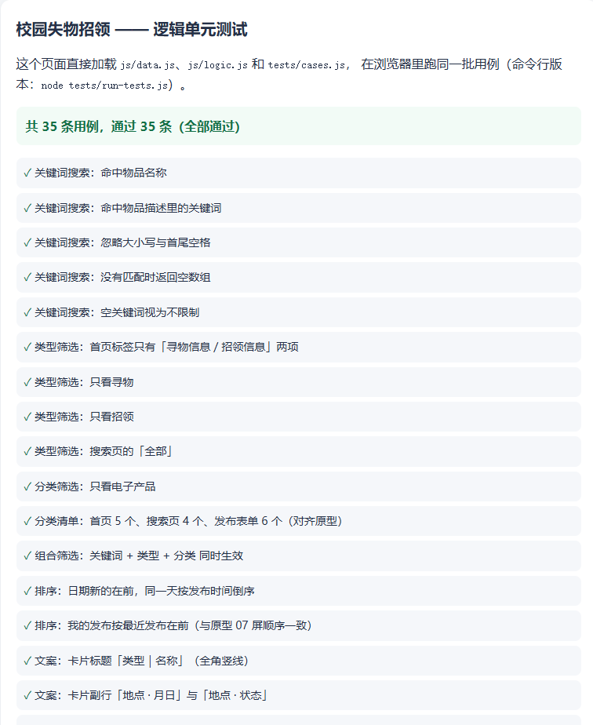
</p>

### Jest 单元测试

首次运行时，在项目根目录执行：

```powershell
Set-Location .\unit-tests
npm.cmd install
npm.cmd test -- --runInBand
```

后续已经安装依赖时，只需执行：

```powershell
Set-Location .\unit-tests
npm.cmd test -- --runInBand
```

使用 `npm.cmd` 可以避免部分 Windows PowerShell 环境中因执行策略限制而无法运行 `npm.ps1` 的问题。

当前 Jest 测试结果：

- 4 个测试文件全部通过
- 67 项测试全部通过
- 0 项测试失败

<p align="center">
  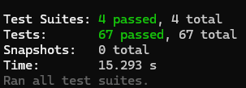
</p>

测试内容覆盖：

- 关键词搜索
- 类型筛选
- 分类筛选
- 多条件组合筛选
- 表单输入校验
- 信息发布
- 信息状态修改
- 页面内容渲染
- 本地数据读取和保存
- 旧版本数据兼容
- 异常存储数据处理

## 附加特点

### 浏览器本地持久化

项目不依赖后端服务器，通过 `localStorage` 保存用户发布的信息和状态变化，使纯静态网页也具备基础的数据持久化能力。

### 多条件组合筛选

用户可以同时使用关键词、信息类型和物品分类进行搜索，提高查找信息的效率。

### 旧数据兼容

存储模块能够处理早期格式的数据，减少项目功能迭代后旧数据无法使用的问题。

### 页面交互动画

项目为页面切换、按钮点击、信息卡片和详情弹窗加入了过渡动画，使操作反馈更加自然。

### 响应式布局

系统以移动端使用场景为主，同时能够在桌面浏览器中正常运行和展示。

## 项目分工

### 包学丰

- 建立项目骨架
- 实现首页信息浏览
- 实现物品详情查看
- 实现浏览器本地存储
- 完善项目结构和使用说明
- 整理 PSP、测试报告和项目截图
- 增加页面交互动画效果
- 负责 GitHub 主仓库管理和 Pull Request 合并

### 冯玄

- 实现关键词搜索
- 实现类型和分类筛选
- 实现寻物与招领信息发布
- 实现“我的发布”
- 实现信息状态修改
- 完善页面样式
- 编写和完善测试用例
- 通过 Fork 和 Pull Request 参与协作开发

## GitHub 协作记录

项目通过功能分支、Fork 和 Pull Request 完成协作开发。

- PR #1：完成首页基础布局和示例信息展示
- PR #2：实现物品详情查看功能
- PR #3：实现浏览器本地数据存储
- PR #4：合并搜索、筛选、发布、状态修改和测试等功能
- PR #5：完善项目结构和使用说明
- PR #6：补充项目测试报告
- PR #7：补充 PSP 实际耗时和项目总结
- PR #8：增加页面交互动画效果
- PR #9：补充功能截图、测试结果、流程图和演示动图

### 提交记录

<p align="center">
  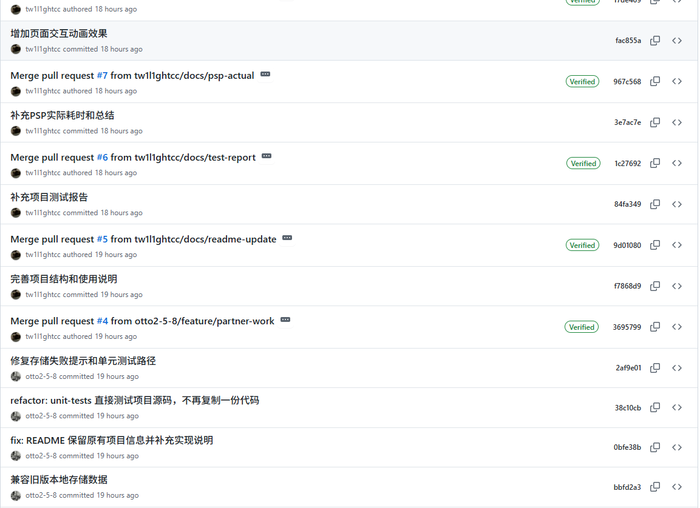
</p>

### Pull Request 记录

<p align="center">
  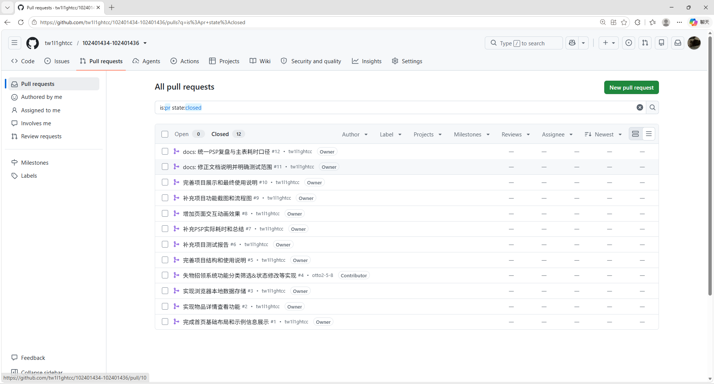
</p>

## 开发过程中遇到的问题

### PowerShell 无法运行 npm

部分 Windows PowerShell 环境会阻止执行 `npm.ps1`，导致输入 `npm` 命令后出现执行策略错误。

解决方法是使用对应的 Windows 命令文件：

```powershell
npm.cmd install
npm.cmd test -- --runInBand
```

### 浏览器本地文件安全限制

直接通过 `file://` 打开网页时，浏览器可能显示本地文件安全提示。项目本身不请求外部文件或网络资源，页面主要功能仍可正常使用，也可以通过 GitHub Pages 运行项目。

### 本地数据格式变化

项目开发过程中数据结构发生变化，旧数据可能缺少新字段。存储模块通过数据标准化和默认值处理兼容旧版本数据。

### Jest 测试进程延迟退出

测试运行完成后，Jest 可能提示进程未立即退出。测试结果仍为全部通过，该提示主要与测试环境中的定时器有关，不影响网页实际运行。

## 项目说明与限制

本项目主要用于课程作业展示，目前没有实现以下功能：

- 后台服务器与云端数据库
- 用户注册和实名认证
- 不同设备之间的数据同步
- 即时聊天
- 图片上传
- 地图定位
- 管理员审核

联系方式和物品数据仅保存在当前浏览器中，请勿在演示数据中填写真实敏感信息。

## 项目主页

<p align="center">
  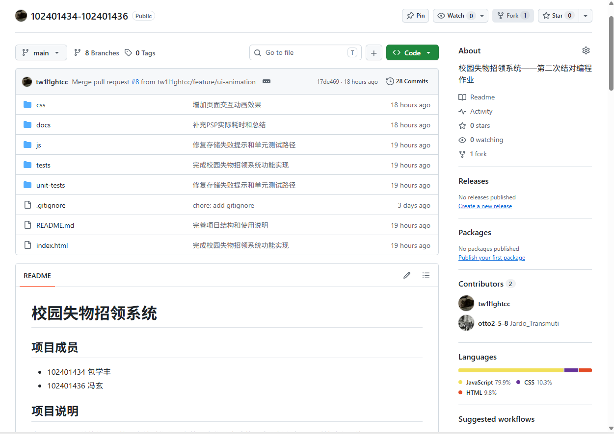
</p>

项目地址：[https://github.com/tw1l1ghtcc/102401434-102401436](https://github.com/tw1l1ghtcc/102401434-102401436)